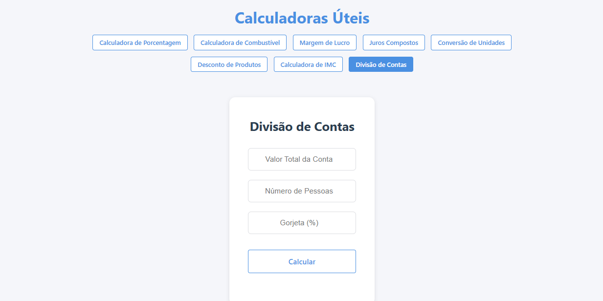

# 🧮 Calculadoras Úteis


Uma coleção de calculadoras úteis para o dia a dia, desenvolvida com React e Vite. Este é um projeto open source e toda contribuição é bem-vinda!

## 📱 Demonstração

<p align="center">
  
</p>

<p align="center">
  
</p>

## 📌 Funcionalidades

O projeto inclui as seguintes calculadoras:

### 💰 Finanças

- **Calculadora de Porcentagem**: Calcule rapidamente porcentagens de qualquer valor
- **Margem de Lucro**: Determine a margem de lucro de produtos e serviços
- **Juros Compostos**: Calcule rendimentos com juros compostos
- **Desconto de Produtos**: Calcule valores com desconto

### 🚗 Transporte

- **Calculadora de Combustível**:
  - Consumo médio (km/L)
  - Custo por quilômetro
  - Custo total da viagem

### 🔄 Conversões

- **Conversor de Unidades**:
  - Distância (km, m, cm)
  - Peso (kg, g, mg)
  - Volume (l, ml)

### 🏥 Saúde

- **Calculadora de IMC**:
  - Cálculo do Índice de Massa Corporal
  - Classificação do resultado

### 💳 Utilidades

- **Divisão de Contas**:
  - Divide o valor entre várias pessoas
  - Calcula gorjeta
  - Mostra valor por pessoa

## 🚀 Como Usar

1. Clone o repositório:
   \`\`\`bash
   git clone https://github.com/agostinhomarcia/calculate.git
   \`\`\`

2. Instale as dependências:
   \`\`\`bash
   cd calculate
   npm install
   \`\`\`

3. Execute o projeto:
   \`\`\`bash
   npm run dev
   \`\`\`

4. Acesse no navegador:
   \`\`\`
   http://localhost:5173
   \`\`\`

## 💻 Tecnologias

- React
- Vite
- JavaScript
- CSS3
- HTML5

## 🌟 Funcionalidades Principais

- Interface intuitiva e amigável
- Cálculos em tempo real
- Design responsivo
- Resultados precisos e formatados
- Navegação simples entre calculadoras

## 🤝 Contribuindo

Este é um projeto open source e adoraríamos receber sua contribuição! Existem várias maneiras de contribuir:

### 🐛 Reportando Bugs

- Abra uma [issue](https://github.com/agostinhomarcia/calculate/issues) descrevendo o bug
- Inclua passos para reproduzir o problema
- Inclua screenshots se possível
- Descreva o comportamento esperado vs o atual

### 💡 Sugerindo Melhorias

- Novas calculadoras
- Melhorias na interface
- Otimizações de código
- Documentação

### 👩‍💻 Contribuindo com Código

1. Fork este repositório
2. Clone seu fork:

   ```bash
   git clone https://github.com/seu-usuario/calculate.git
   ```

3. Crie uma branch para sua feature:

   ```bash
   git checkout -b feature/nome-da-feature
   ```

4. Configure o ambiente:

   ```bash
   npm install
   npm run dev
   ```

5. Faça suas alterações seguindo nossas convenções:

   - Use commits semânticos (feat:, fix:, docs:, etc)
   - Mantenha o código limpo e documentado
   - Siga o estilo de código existente

6. Teste suas alterações
7. Commit suas mudanças:

   ```bash
   git commit -m "feat: Adiciona nova calculadora"
   ```

8. Push para seu fork:

   ```bash
   git push origin feature/nome-da-feature
   ```

9. Abra um Pull Request

### 📝 Convenções do Projeto

- **Commits Semânticos:**

  - `feat:` Nova funcionalidade
  - `fix:` Correção de bug
  - `docs:` Documentação
  - `style:` Formatação
  - `refactor:` Refatoração
  - `test:` Testes
  - `chore:` Manutenção

- **Estrutura de Arquivos:**
  ```
  src/
  ├── components/    # Componentes React
  ├── styles/       # Arquivos CSS
  ├── utils/        # Funções utilitárias
  └── assets/       # Imagens e recursos
  ```

### ✨ Ideias para Contribuir

- [ ] Calculadora de Média Ponderada
- [ ] Calculadora de Tempo (diferença entre datas)
- [ ] Calculadora de Impostos
- [ ] Conversor de Moedas
- [ ] Temas Claro/Escuro
- [ ] Testes Unitários
- [ ] Melhorias de Acessibilidade
- [ ] Suporte para PWA

## 📊 Status do Projeto


## 📝 Licença

Este projeto está sob a licença MIT. Veja o arquivo [LICENSE](LICENSE) para mais detalhes.

## 👩‍💻 Autor

Feito com ❤️ por [Márcia Agostinho](https://github.com/agostinhomarcia)
